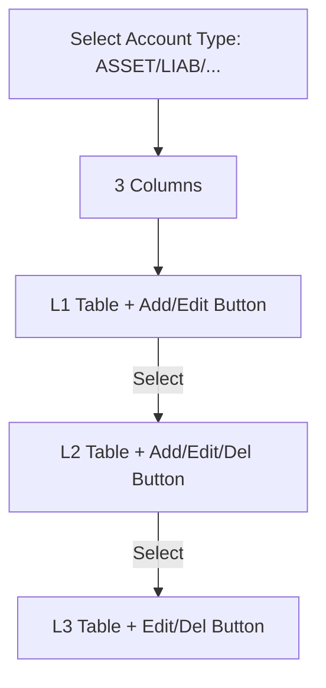

# CoA UI Refactor Plan: Removing AgGrid for Native Stability

## 1. Executive Summary
The current Chart of Accounts (CoA) page implementation relies on `st-aggrid`, which introduces structural state management issues and UX glitches (selection loss, refresh token loops). This plan outlines the transition to native Streamlit components (`st.dataframe` + `selection_mode`) to ensure 100% stability, better keyboard accessibility, and a cleaner codebase.

## 2. Objective
- **Remove External Dependency**: Eliminate `st-aggrid` to reduce complexity and potential library version conflicts.
- **State Persistence**: Use Streamlit's native selection state to ensure selections are never lost during actions.
- **UX Optimization**: Replace clunky in-cell dropdowns with context-aware action buttons (Action Bar).
- **Miller Column Layout**: Maintain the efficient 3-column (L1 → L2 → L3) drill-down flow.

## 3. Current vs. Proposed UX

| Feature | AgGrid (Current) | Native (Proposed) |
| :--- | :--- | :--- |
| **Selection** | Custom `st.session_state` + Grid Events | `st.dataframe(on_select='rerun')` |
| **Actions** | In-cell "⋯" Selector (Community Tier) | Top/Bottom Action Buttons (Icon + Label) |
| **Filtering** | AgGrid built-in filters (Stateful) | `st.text_input` or standard `st.dataframe` search |
| **Layout** | Fixed-height columns | Responsive containers with auto-scaling |
| **Interaction** | Selection lost on action menu click | Selections persist via standard rerun mechanism |

## 4. Implementation Plan

### 4.1. Step 1: Selection Engine Refactor
- Replace `_render_aggrid` with a native wrapper using `st.dataframe`.
- Use `selection_mode="multiple_rows"` or `"single_row"` depending on context.
- Sync `st.dataframe` selection indices directly with account IDs.

### 4.2. Step 2: Action Menu Migration
- Remove the "Action" column ("⋯") from the dataframe.
- Add a "Small Action Bar" above each table column:
  - **L1 Column**: ➕ (Add L2) | ✏️ (Edit)
  - **L2 Column**: ➕ (Add L3) | ✏️ (Edit) | 🗑️ (Delete)
  - **L3 Column**: ✏️ (Edit) | 🗑️ (Delete)
- Ensure buttons are only enabled when a valid row is selected.

### 4.3. Step 3: Layout & Consistency
- Polish the Miller Columns using `st.container(border=True)` for visual grouping.
- Use `column_config` in `st.dataframe` to display status (Active/Inactive) as checkmarks or colored badges.

### 4.4. Step 4: Cleanup
- Remove imports related to `st_aggrid`.
- Delete unused custom CSS/JavaScript helper functions.

## 5. Proposed UX Mockup (Concept)

## 6. Verification Plan
- **Persistence Test**: Select an L1 row, click "Add Sub-account", close dialog, and verify L1 selection remains active.
- **Action Flow**: Ensure all CRUD operations (Create/Update/Delete) trigger a refresh while maintaining the "path" (selected hierarchy).
- **Empty Case**: Verify clear UI feedback when a selected L1 has no L2 sub-accounts.

---
**Request for Approval**: Please review the proposed UX changes (shifting from in-cell actions to header action buttons) before I proceed with the implementation.
